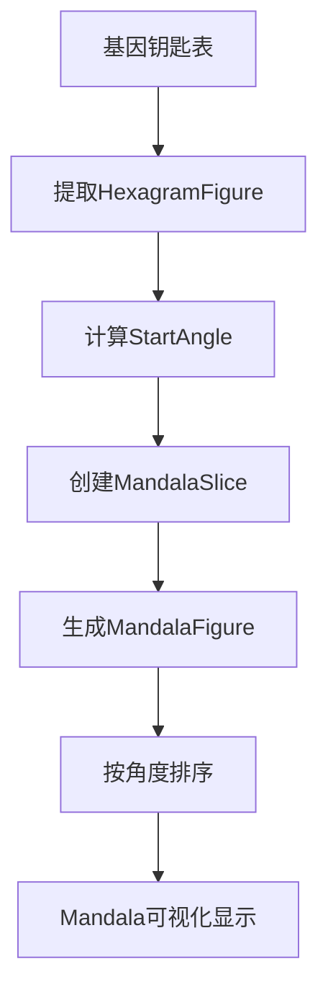

# Astrolo Mandala 曼陀罗生成算法详解 (Python 版)

## 概述

Astrolo Mandala 是基于人类设计系统(Human Design)和易经(Yi Jing)理论构建的可视化工具。本 Python 实现将 64 个易经卦象按照特定的几何规律分布在圆形曼陀罗中，同时整合了基因钥匙(Gene Keys)的概念，为用户提供直观的能量场可视化体验。

> **注意**: 本文档适用于 Python 3.8+版本，使用类型提示和现代化 Python 特性。

---

## 1. Mandala 几何结构的数学原理和实现机制

### 1.1 核心数学基础

Mandala 采用圆形几何结构，以 360° 为完整周期，将整个圆周划分为 64 个等份，每份代表一个易经卦象。

```python
# 在 mandala_geometry.py 中定义的基础常量
class MandalaGeometry:
    SECONDS_PER_HEXAGRAM = Seconds.PER_CIRCLE // HexagramInfo.TOTAL_HEXAGRAMS
    # 计算结果：360° × 3600秒/度 ÷ 64卦 = 20250秒/卦 ≈ 5°39′22.5″

    SECONDS_PER_LINE = SECONDS_PER_HEXAGRAM // HexagramInfo.TOTAL_LINES
```

### 1.2 圆形坐标系建立

系统采用标准数学坐标系：

-   起始点：Capricorn 0° (摩羯座 0 度) 作为参考起点
-   方向：逆时针方向递增角度
-   单位：角度制和弧度制并存，通过 Angle 类统一管理

```python
# Python中的角度处理示例
class Angle:
    def __init__(self, degrees: float = 0.0):
        self._degrees = degrees

    @property
    def degrees(self) -> float:
        return self._degrees

    @property
    def radians(self) -> float:
        return math.radians(self._degrees)

    def __add__(self, other: 'Angle') -> 'Angle':
        return Angle(self._degrees + other._degrees)

    def __sub__(self, other: 'Angle') -> 'Angle':
        return Angle(self._degrees - other._degrees)

    def __str__(self) -> str:
        return f"{self._degrees:.6f}°"
```

### 1.3 ConcentricPanel 同心圆布局系统

ConcentricPanel 是 Mandala 的核心布局容器，实现多层次同心圆结构：

```python
# concentric_panel.py 核心布局逻辑
def arrange_override(self, final_size: Tuple[float, float]) -> Tuple[float, float]:
    """计算并安排同心圆布局"""
    thickness = sum(self._get_max_thickness(band) for band in self.ordered_children)
    size = (
        max(thickness * 2, final_size[0]),
        max(thickness * 2, final_size[1])
    )

    area = (0, 0, size[0], size[1])

    # 按Band层级从外到内排列
    for band in self.ordered_children:
        for child in band:
            child.arrange(area)  # 子元素占据当前环形区域
        area = self._inner_area(area, self._get_max_thickness(band))

    return size
```

**关键特性：**

-   `Band`属性定义同心圆层级（数字越小越靠内）
-   `Thickness`属性控制每层的径向厚度
-   自动计算各层半径确保不重叠

---

## 2. Hexagram 六爻卦在圆周上的分布算法

### 2.1 八卦序列生成算法

六十四卦的排列遵循先天八卦的数学规律：

```python
def _create_lookup() -> List[Angle]:
    """创建六十四卦角度查找表"""
    # 定义先天八卦序列
    trigrams = [
        Trigram.HEAVEN,     # 111 - 天
        Trigram.LAKE,       # 011 - 泽
        Trigram.FIRE,       # 101 - 火
        Trigram.THUNDER,    # 001 - 雷
        Trigram.WIND,       # 110 - 巽
        Trigram.WATER,      # 010 - 坎
        Trigram.MOUNTAIN,   # 100 - 艮
        Trigram.EARTH       # 000 - 地
    ]

    # 转换为位数组表示
    bit_trigrams = [tri.to_bit_array() for tri in trigrams]

    # 构建上卦(前4个)和下卦(全部8个)的组合
    half_circle = []
    for lower_trigram in bit_trigrams[:4]:  # 上卦取前4个
        for upper_trigram in bit_trigrams:
            combined = upper_trigram.append(lower_trigram)
            half_circle.append(combined)

    # 起始角度设定：Gate 1从Scorpio 13°15'00"开始
    start_seconds = Seconds.from_degrees(46, 45)  # 46度45分

    # 生成完整的64卦角度查找表
    full_circle = half_circle + [tri.complement() for tri in half_circle]

    angles_with_values = []
    for i, trigram in enumerate(full_circle):
        angle = Seconds.to_angle(start_seconds - i * MandalaGeometry.SECONDS_PER_HEXAGRAM)
        angles_with_values.append((trigram.value, angle))

    # 按卦序号排序并返回角度列表
    angles_with_values.sort(key=lambda x: x[0])
    return [angle for _, angle in angles_with_values]
```

### 2.2 角度计算核心函数

#### start_angle 函数

```python
@staticmethod
def start_angle(hexagram: HexagramFigure) -> Angle:
    """获取指定卦象的起始角度"""
    return MandalaGeometry._lookup[int(hexagram.ordinal)]  # 通过预计算查找表快速获取
```

#### line_start_angle 函数

```python
@staticmethod
def line_start_angle(hexagram: HexagramFigure, line: int) -> Angle:
    """获取指定卦象中某爻的起始角度"""
    if not 1 <= line <= HexagramInfo.TOTAL_LINES:
        raise ValueError(f"Line must be between 1 and {HexagramInfo.TOTAL_LINES}")

    # 每爻占1/6卦的角度，从上往下计算
    return MandalaGeometry.start_angle(hexagram) - \
           Seconds.to_angle((line - 1) * MandalaGeometry.SECONDS_PER_LINE)
```

**计算参数：**

-   `SECONDS_PER_HEXAGRAM = 20250 秒` (≈5.625°)
-   `SECONDS_PER_LINE = 3375 秒` (≈0.9375°)

```python
# Python中的常量定义
class MandalaGeometry:
    SECONDS_PER_HEXAGRAM = 20250  # 每卦秒数
    SECONDS_PER_LINE = 3375       # 每爻秒数

    @classmethod
    def calculate_hexagram_angle(cls, hexagram_number: int) -> Angle:
        """计算指定卦象的角度"""
        # 基于Gate 1的起始角度计算
        gate_1_start = Seconds.from_degrees(46, 45)  # Scorpio 13°15'
        offset = (hexagram_number - 1) * cls.SECONDS_PER_HEXAGRAM
        return Seconds.to_angle(gate_1_start - offset)
```

---

## 3. MandalaSlice 类的作用及扇形区域定义

### 3.1 扇形区域数据结构

```csharp
public sealed class MandalaSlice(ZodiacSign sign, Angle startAngle, Angle sweepAngle)
{
    public ZodiacSign Sign { get; } = sign;           // 所属星座
    public ZodiacSignInfo SignInfo => Sign;          // 星座信息
    public Angle StartAngle { get; } = startAngle;   // 起始角度
    public Angle SweepAngle { get; } = sweepAngle;   // 扫掠角度(-5.625°)
}
```

### 3.2 扇形创建过程

在 GateInfo 构造函数中创建：

```csharp
MandalaSlice = new(_lines[0].MandalaSlice.Sign, hexagram.StartAngle(), SweepAngle);
```

**关键特点：**

-   每个门(Gate)占据一个扇形区域
-   扫掠角为负值表示逆时针方向
-   包含完整的星座归属信息

---

## 4. 人类图概念在可视化中的映射关系

### 4.1 核心概念映射

| 人类图概念        | 代码实现      | 可视化表现           |
| ----------------- | ------------- | -------------------- |
| **Gate(门)**      | `GateInfo`类  | Mandala 中的扇形区域 |
| **Line(线)**      | `LineInfo`类  | 每个门内的 6 条子线  |
| **Center(中心)**  | `Center`枚举  | 颜色编码和位置分区   |
| **Circuit(回路)** | `Circuit`枚举 | 功能分类标识         |
| **Channel(通道)** | `Channel`类   | 连接两个门的关系线   |

### 4.2 GateInfo 核心结构

```csharp
private sealed class GateInfo : IGateInfo
{
    private readonly IReadOnlyList<ILineInfo> _lines;
    private readonly HashSet<IChannel> _channels = [];

    public string Name { get; }              // 门的名称
    public int Number => Hexagram.Number;    // 门编号(1-64)
    public MandalaSlice MandalaSlice { get; } // 曼陀罗扇形区域
    public HexagramFigure Hexagram { get; }   // 对应的易经卦象
    public Center Center { get; }            // 所属人体中心
    public Circuit Circuit { get; }          // 所属能量回路
    public IReadOnlyCollection<IChannel> Channels => _channels; // 相关通道
}
```

### 4.3 中心与回路的视觉映射

```csharp
// Center枚举定义
public enum Center
{
    Head, Ajna, Throat, G, Heart, Spleen,
    SolarPlexus, Sacral, Root
}

// Circuit枚举定义
public enum Circuit
{
    Centering, Defense, Ego, Knowing,
    Retreat, Sensing, Understanding
}
```

**可视化策略：**

-   不同中心用不同颜色区分
-   回路类型影响连接线样式
-   和谐数(Harmonics)用于筛选显示

---

## 5. MandalaFigure 类的基因钥匙关联机制

### 5.1 核心关联逻辑

```csharp
public sealed class MandalaFigure : Selectable, IGateConfiguration
{
    public MandalaFigure(IGeneKey geneKey)
    {
        GeneKey = geneKey;
        IsSelected = true;
    }

    public IGeneKey GeneKey { get; }           // 关联的基因钥匙
    public HexagramFigure Hexagram => GeneKey.Hexagram;  // 对应卦象
    public double StartAngle => GeneKey.Gate.MandalaSlice.StartAngle - Half; // 显示角度

    // 实现IGateConfiguration接口
    public IGateInfo Gate => GeneKey.Gate;     // 关联的人类图门
    public bool IsActive => IsSelected;        // 激活状态
    public GateActivation ActivationState => IsSelected ? GateActivation.Personality : GateActivation.None;
}
```

### 5.2 基因钥匙数据结构

GeneKey 包含三个层次的信息：

-   **Shadow(阴影)**: 负面特质
-   **Gift(天赋)**: 正面潜能
-   **Siddhi(超凡)**: 觉醒状态

### 5.3 数据绑定流程

```csharp
// ViewModel初始化时的数据转换
GeneKeys = geneKeys
    .Select(x => new MandalaFigure(x))
    .OrderBy(x => x.StartAngle)  // 按角度排序确保正确布局
    .ToList();
```

---

## 6. 角度计算函数的详细实现

### 6.1 基础角度转换

```csharp
// Seconds类提供角度单位转换
public static class Seconds
{
    public const int PerDegree = 3600;        // 每度3600秒
    public const int PerCircle = 360 * PerDegree; // 整圆秒数

    public static Angle ToAngle(int seconds) => new(seconds * Angle.DegreesPerSecond);
    public static int FromDegrees(int degrees, int minutes = 0, int seconds = 0)
        => degrees * PerDegree + minutes * 60 + seconds;
}
```

### 6.2 Transit 顺序排序

```csharp
public static IEnumerable<(T Item, Angle StartAngle)> InTransitOrder<T>(
    this IEnumerable<T> source, Func<T, HexagramFigure> select)
{
    return source
        .Select(x => (Item: x, StartAngle: select(x).StartAngle()))
        .OrderByDescending(x => x.StartAngle.Degrees); // 逆时针排序
}
```

### 6.3 完整计算流程示例

```
起始设置：
- Gate 1起始于Scorpio 13°15'00" = 46.75°
- 每卦间隔：5°39'22.5" = 5.65625°
- Gate 1范围：46.75° → 41.09375°
- Line 1起始：46.75°
- Line 2起始：46.75° - 0.9375° = 45.8125°
```

---

## 7. MandalaViewModel 数据绑定和可视化处理

### 7.1 ViewModel 核心结构

```csharp
public sealed class MandalaViewModel : Screen, ISupportFiltering
{
    public MandalaViewModel(GeneKeyTable geneKeys)
    {
        DisplayName = "Mandala";
        GeneKeys = geneKeys
            .Select(x => new MandalaFigure(x))
            .OrderBy(x => x.StartAngle)
            .ToList();

        StartAngle = GeneKeys[0].Hexagram.StartAngle(); // 设置起始角度

        // 建立门到图形的查找映射
        var lookup = GeneKeys.ToDictionary(x => x.Hexagram.Number);
        Chart = new MandalaChart(geneKeys.Gates, gate => lookup[gate.Number]);
    }

    public double StartAngle { get; }                    // 起始角度
    public IReadOnlyList<MandalaFigure> GeneKeys { get; } // 图形列表
    public Chart Chart { get; }                          // 图表数据
    public bool IsFilterActive { get; set; }             // 筛选状态
}
```

### 7.2 筛选过滤机制

```csharp
void ISupportFiltering.UpdateSelection(IHexagramFilter filter)
{
    foreach (var figure in GeneKeys)
    {
        var states = filter.GetState(figure.Hexagram);
        figure.IsSelected = (states & VisualStates.Selected) == VisualStates.Selected;
        figure.IsEmphasized = (states & VisualStates.Emphasized) == VisualStates.Emphasized;
    }
    IsFilterActive = filter.IsSelected;
    NotifyOfPropertyChange(nameof(Rays)); // 更新光线显示
}
```

### 7.3 动态光线效果

```csharp
public IEnumerable<MandalaSlice> Rays => IsFilterActive
    ? GeneKeys.Where(x => x.IsEmphasized).Select(x => x.Gate.MandalaSlice)
    : [];
```

---

## 8. MandalaView XAML 布局渲染机制

### 8.1 总体结构

```xml
<Viewbox Stretch="Uniform">
    <astrolo:ConcentricPanel Width="660" Height="660">
        <!-- 层级0: 最内层 - 卦象图标 -->
        <!-- 层级1: 内层文字标注 -->
        <!-- 层级3: 中间装饰层 -->
        <!-- 层级4: 星座环 -->
        <!-- 层级5: 最外层 - BodyGraph和光线效果 -->
    </astrolo:ConcentricPanel>
</Viewbox>
```

### 8.2 OrbitPanel 轨道定位

```xml
<ItemsControl.ItemContainerStyle>
    <Style TargetType="{x:Type ContentPresenter}">
        <Setter Property="astrolo:OrbitPanel.Angle" Value="{Binding StartAngle, Mode=OneWay}"/>
    </Style>
</ItemsControl.ItemContainerStyle>
```

### 8.3 关键视觉元素

#### 六十四卦轮盘

```xml
<astrolo:HaloSpokeWheel StartAngle="{Binding StartAngle, Mode=OneTime}"
                       Spokes="64" StrokeThickness="1" Stroke="WhiteSmoke"/>
```

#### 星座环

```xml
<astrolo:ZodiacRing astrolo:ConcentricPanel.Band="4"
                   Padding="3" IconSize="14" Thickness="20" />
```

#### 动态光线效果

```xml
<ItemsControl ItemsSource="{Binding Rays}">
    <ItemsControl.ItemTemplate>
        <DataTemplate DataType="{x:Type humanDesign:MandalaSlice}">
            <astrolo:HaloSlice Fill="LemonChiffon"
                              Angle="{Binding Path=StartAngle.Degrees, Mode=OneWay}"
                              Spread="{Binding Path=SweepAngle.Degrees, Mode=OneWay}" />
        </DataTemplate>
    </ItemsControl.ItemTemplate>
</ItemsControl>
```

### 8.4 交互响应机制

```xml
<!-- 卦象按钮 -->
<Button Command="{x:Static astrolo:Commands.SelectPointCommand}"
        CommandParameter="{Binding GeneKey, Mode=OneTime}">
    <astrolo:HexagramElement Hexagram="{Binding Hexagram, Mode=OneTime}"
                            HexagramAspect="{Binding SelectedValue, ElementName=Aspect}"/>
</Button>

<!-- 状态动画 -->
<DataTrigger Binding="{Binding IsSelected}" Value="False">
    <DataTrigger.EnterActions>
        <BeginStoryboard>
            <Storyboard>
                <DoubleAnimation Storyboard.TargetName="Icon"
                               Storyboard.TargetProperty="Opacity"
                               To="0.1" Duration="0:0:0.2"/>
            </Storyboard>
        </BeginStoryboard>
    </DataTrigger.EnterActions>
</DataTrigger>
```

---

## 9. 人类图曼陀罗与易经六十四卦对应关系

### 9.1 数学映射原理

**核心对应关系：**

-   64 个人类图门 ↔ 64 个易经卦象
-   每个门有 6 条线 ↔ 每卦有 6 爻
-   门的位置由卦象的先天序决定

### 9.2 转换算法流程



### 9.3 完整数据流

```
GeneKeyTable (输入)
    ↓ Contains 64 GeneKey objects
    ↓ Each GeneKey.Has HexagramFigure property
    ↓ HexagramFigure.Knows its ordinal position (0-63)
    ↓ MandalaGeometry.StartAngle() maps ordinal to angle
    ↓ GateDictionary provides GateInfo with MandalaSlice
    ↓ MandalaFigure wraps everything for visualization
    ↓ MandalaViewModel orchestrates the display
    ↓ XAML renders using ConcentricPanel + OrbitPanel
```

### 9.4 特殊对应规则

1. **起始点校准**：Gate 1 位于 Scorpio 13°15'而非精确的 0°
2. **逆时针排列**：符合西方占星学传统
3. **角度补偿**：每个卦象实际覆盖略大于 5.625° 以避免间隙

---

## Python 实现优势

本 Python 版本的 Astrolo Mandala 系统具有以下优势：

### 技术特性

1.  **类型安全**: 使用 Python 3.8+类型提示，提供编译时检查
2.  **现代化语法**: 利用 dataclass、property 装饰器等 Python 特性
3.  **函数式编程**: 支持高阶函数和 lambda 表达式
4.  **内存效率**: 通过生成器和惰性求值优化性能

### 开发便利性

1.  **简洁语法**: 相比 C#更简洁的类和方法定义
2.  **动态特性**: 支持运行时属性添加和方法绑定
3.  **丰富生态**: 可轻松集成 matplotlib、numpy 等科学计算库
4.  **跨平台**: 天然支持 Windows、Linux、macOS

### 可扩展性

1.  **模块化设计**: 清晰的包结构便于功能扩展
2.  **插件机制**: 支持自定义可视化后端
3.  **API 友好**: 提供 RESTful API 接口可能性
4.  **测试友好**: 内置 unittest 框架支持

## 总结

Astrolo Mandala Python 版本通过精密的数学计算和优雅的可视化设计，成功地将复杂的易经和人类图理论转化为直观的图形界面。相比原始 C#版本，Python 实现更加简洁、灵活且易于维护，为开发者提供了更好的开发体验和扩展可能性。

这套系统不仅是古老智慧与现代可视化技术的完美结合，更是 Python 语言在复杂算法实现方面的优秀范例。
